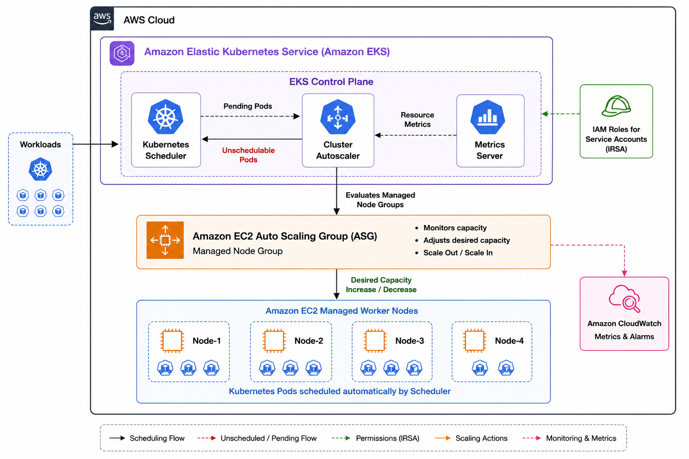

## 🚀 Kubernetes Cluster Autoscaler 

---
## 📖 Project Overview

This repository demonstrates a **production-ready implementation of Kubernetes Cluster Autoscaler on Amazon EKS**, showcasing how Kubernetes automatically adjusts the cluster size by provisioning or terminating worker nodes based on application demand.

The project follows AWS and Kubernetes best practices by integrating **IAM Roles for Service Accounts (IRSA)**, **Auto Scaling Groups (ASGs)**, and **least-privilege IAM policies** to enable secure, reliable, and automated node scaling in production environments.

Beyond deployment, this repository focuses on understanding the complete autoscaling lifecycle—including scheduler decisions, scale-up and scale-down events, troubleshooting common issues, monitoring autoscaler behavior, and optimizing infrastructure costs for real-world Kubernetes workloads.

---
## 🎯 Key Objectives

- Deploy **Cluster Autoscaler** on Amazon EKS using **IAM Roles for Service Accounts (IRSA)**
- Automatically provision worker nodes for pending workloads
- Safely remove underutilized nodes to optimize infrastructure costs
- Integrate Kubernetes with AWS Auto Scaling Groups
- Implement secure IAM authentication without static AWS credentials
- Understand Kubernetes scheduling decisions and autoscaler workflows
- Troubleshoot common scaling failures and scheduling issues
- Monitor autoscaler events, logs, and cluster behavior
- Apply production best practices for high availability, scalability, and cost optimization

---
### 🌟 Why This Project Matters

Modern Kubernetes platforms require infrastructure that can automatically adapt to changing workloads while minimizing operational overhead and cloud costs. This project provides practical experience with one of the most widely used Kubernetes autoscaling solutions in production environments.

Through this implementation, you will learn how to:

- ✅ Understand Kubernetes scheduler and Cluster Autoscaler interactions
- ✅ Diagnose real-world scheduling and scaling failures
- ✅ Configure secure AWS authentication using IRSA
- ✅ Optimize infrastructure utilization through intelligent scale-down
- ✅ Improve application availability during traffic spikes
- ✅ Reduce cloud costs by eliminating idle compute resources
- ✅ Build scalable and production-ready Kubernetes platforms on Amazon EKS

---
## 🎯 Architecture



---
## ✨ Features

- 🚀 **Automatic Node Scaling**
  - Automatically provisions new worker nodes when pods cannot be scheduled due to insufficient cluster resources.

- 📉 **Intelligent Scale-Down**
  - Detects underutilized nodes and safely removes them to reduce infrastructure costs while maintaining application availability.

- ☸️ **Native Kubernetes Integration**
  - Works seamlessly with the Kubernetes Scheduler to dynamically adjust cluster capacity based on pending workloads.

- ☁️ **Amazon EKS Integration**
  - Integrates directly with Amazon EKS and EC2 Auto Scaling Groups for automated node lifecycle management.

- 🔐 **Secure Authentication with IRSA**
  - Uses IAM Roles for Service Accounts (IRSA) to securely access AWS APIs without storing long-lived AWS credentials.

- ⚙️ **Auto Scaling Group Discovery**
  - Automatically discovers and manages EC2 Auto Scaling Groups using AWS resource tags.

- 📊 Cluster Scaling Visibility
  - Provides detailed logs and Kubernetes events for monitoring scale-up and scale-down operations.

- 🛠️ Production-Ready Configuration
  - Implements AWS and Kubernetes best practices for reliability, scalability, and security.

- 💰 Cost Optimization
  - Eliminates idle infrastructure by automatically terminating unused worker nodes after workloads complete.

- ⚡ Responsive Scaling
  - Quickly provisions additional compute capacity during traffic spikes or resource-intensive workloads.

- 🧩 Multi-Node Group Support
  - Supports scaling across multiple managed node groups and Auto Scaling Groups within an Amazon EKS cluster.

- 🏷️ Intelligent Scheduling Support
  - Respects Kubernetes scheduling constraints including labels, taints, tolerations, node selectors, and affinity rules.

- 📈 High Availability
  - Ensures applications have sufficient compute resources by automatically expanding cluster capacity when required.

- 🔍 Troubleshooting & Observability
  - Includes autoscaler logs, Kubernetes events, and AWS Auto Scaling integration for effective debugging.

- 📚 Production Learning Project
  - Demonstrates real-world deployment, configuration, monitoring, troubleshooting, and optimization of Kubernetes Cluster Autoscaler on Amazon EKS.

---

## 📋 Prerequisites

Before deploying Kubernetes Cluster Autoscaler on Amazon EKS, ensure the following requirements are met:

### Infrastructure

- AWS Account with appropriate IAM permissions
- Amazon EKS cluster (Kubernetes v1.29 or later recommended)
- At least one Amazon EKS Managed Node Group
- EC2 Auto Scaling Group associated with the node group
- Worker nodes in **Ready** state

### Required Tools

| Tool | Recommended Version |
|------|----------------------|
| AWS CLI | v2.x |
| kubectl | Compatible with your EKS cluster version |
| eksctl | Latest |
| Helm | v3.x |
| Git | Latest |

### AWS Permissions

The IAM user or role used for deployment should have permissions to manage:

- Amazon EKS
- EC2
- Auto Scaling Groups
- IAM
- CloudFormation (if using `eksctl`)
- Amazon VPC (for cluster provisioning)

### Kubernetes Requirements

- Metrics Server installed and running
- Kubernetes API server accessible
- `kubectl` configured to communicate with the EKS cluster
- Cluster Autoscaler version compatible with the Kubernetes cluster version

### IAM Configuration

- OpenID Connect (OIDC) provider associated with the EKS cluster
- IAM Roles for Service Accounts (IRSA) enabled
- Least-privilege IAM policy for Cluster Autoscaler

### Auto Scaling Group Configuration

- Managed Node Group or Self-Managed Node Group
- Auto Scaling Group tagged for auto-discovery:

```text
k8s.io/cluster-autoscaler/enabled = true
k8s.io/cluster-autoscaler/<cluster-name> = owned
```

### Verify Connectivity

Before proceeding, verify access to your cluster:

```bash
aws sts get-caller-identity

aws eks update-kubeconfig \
  --region <aws-region> \
  --name <cluster-name>

kubectl get nodes
```

### Recommended Knowledge

- Basic Kubernetes concepts
- Amazon EKS fundamentals
- IAM Roles and Policies
- EC2 Auto Scaling Groups
- Kubernetes Deployments and Pods
- Basic Linux command-line experience

---
### Flow Explanation

1. Pods are created in Kubernetes
2. Scheduler tries to place them on nodes
3. If unschedulable → marked as `Pending`
4. Cluster Autoscaler detects this
5. Calls AWS Auto Scaling Group (ASG)
6. New EC2 node is launched
7. Node joins cluster
8. Pod gets scheduled

---
## 🏗️ Architecture Components

- **Kubernetes API Server** – control plane
- **Cluster Autoscaler** – decision engine
- **AWS Auto Scaling Group (ASG)** – node provisioning
- **EC2 Worker Nodes** – compute layer
- **Pods** – workload drivers

---
## 🔐 IAM Setup for Cluster Autoscaler (IRSA)

This section configures secure AWS access for Cluster Autoscaler using **IAM Roles for Service Accounts (IRSA)**.

---
### 📄 IAM Policy (Permissions)

```hcl
data "aws_iam_policy_document" "autoscaler" {
  statement {
    effect    = "Allow"
    resources = ["*"]

    actions = [
      "autoscaling:DescribeAutoScalingGroups",
      "autoscaling:DescribeAutoScalingInstances",
      "autoscaling:DescribeLaunchConfigurations",
      "autoscaling:DescribeScalingActivities",
      "autoscaling:DescribeTags",
      "ec2:DescribeInstanceTypes",
      "ec2:DescribeLaunchTemplateVersions"
    ]
  }

  statement {
    effect    = "Allow"
    resources = ["*"]

    actions = [
      "autoscaling:SetDesiredCapacity",
      "autoscaling:TerminateInstanceInAutoScalingGroup",
      "eks:DescribeNodegroup",
    ]

    condition {
      test     = "StringEquals"
      variable = "autoscaling:ResourceTag/k8s.io/cluster-autoscaler/${local.cluster_name}"
      values   = ["owned"]
    }
  }
}
```
### Explanation

#### 1. Read-Only Permissions
The first statement grants **read-only access** to AWS resources.  
This is required for the autoscaler to **discover and understand the current infrastructure state**, including:

- Auto Scaling Groups
- EC2 instance types
- Launch configurations
- Scaling activities

---
#### 2. Scaling Permissions
The second statement provides permissions to **modify infrastructure capacity**, allowing the autoscaler to:

- Increase node count when demand rises
- Decrease node count when resources are underutilized

---
#### 3. Security Condition (Critical)

A condition block is applied to restrict scaling actions based on resource tags.

##### Purpose:
- Ensures actions are performed **only on node groups belonging to the specific cluster**
- Prevents accidental or unauthorized scaling of resources in **other clusters**

##### Benefit:
- Acts as a **critical security control**
- Avoids **cross-cluster impact**
- Enforces **least privilege principle**

---
### ✅ Summary

| Component            | Purpose                                   |
|---------------------|--------------------------------------------|
| Read Permissions     | Discover infrastructure state             |
| Scaling Permissions  | Adjust cluster capacity                   |
| Condition Block      | Enforce cluster-level isolation & security|

---
### 📦 IAM Policy Resource

Defines the IAM policy used by the Cluster Autoscaler.

```hcl
resource "aws_iam_policy" "autoscaler" {
  name   = "${var.cluster-name}-autoscaler"
  policy = data.aws_iam_policy_document.autoscaler.json
}
```
---
### 🔑 IAM Role Trust Policy (IRSA)

Defines the trust relationship using IAM Roles for Service Accounts (IRSA).
```hcl
data "aws_iam_policy_document" "autoscaler_assume" {
  statement {
    actions = ["sts:AssumeRoleWithWebIdentity"]

    principals {
      type        = "Federated"
      identifiers = [var.oidc_provider_arn]
    }

    condition {
      test     = "StringEquals"
      variable = "${replace(var.oidc_provider_url, "https://", "")}:sub"
      values   = ["system:serviceaccount:kube-system:cluster-autoscaler"]
    }

    condition {
      test     = "StringEquals"
      variable = "${replace(var.oidc_provider_url, "https://", "")}:aud"
      values   = ["sts.amazonaws.com"]
    }
  }
  ```
---
### 🔍 Explanation
#### 🎯 Service Account Restriction

* Grants access only to:
```bash  
    kube-system/cluster-autoscaler
```
* Prevents any other pod from assuming this role
---

#### 🔐 OIDC Authentication
* Uses the EKS OIDC provider for secure authentication
* Eliminates the need for static AWS credentials

---
#### 🛡️ Least Privilege Enforcement
* The sub condition ensures:
    * Only the specific Kubernetes service account can assume the role
* The aud condition ensures:
    * The token is intended for AWS STS (sts.amazonaws.com)

---
#### 🏷️ IAM Role

Creates the IAM role used by the Cluster Autoscaler.

```hcl 
resource "aws_iam_role" "autoscaler" {
  name               = "${var.cluster-name}-autoscaler"
  assume_role_policy = data.aws_iam_policy_document.autoscaler_assume.json
}
```
---
#### 🔗 Attach Policy to Role

Binds the IAM policy to the IAM role.

```hcl 
resource "aws_iam_role_policy_attachment" "autoscaler" {
  role       = aws_iam_role.autoscaler.name
  policy_arn = aws_iam_policy.autoscaler.arn
}
```
---

✅ Summary

| Component            | Purpose                                    |
|----------------------|--------------------------------------------|
| IAM Policy           | Defines autoscaler permissions             |
| Trust Policy (IRSA)  | Enables secure role assumption via OIDC    |
| IAM Role             | Identity used by Kubernetes service account|
| Policy Attachment    | Grants permissions to the role             |

---
### ⚙️ Kubernetes Service Account Annotation

Bind the IAM role to the Cluster Autoscaler pod using **IRSA annotation**:

```yaml
apiVersion: v1
kind: ServiceAccount
metadata:
  name: cluster-autoscaler
  namespace: kube-system
  annotations:
    eks.amazonaws.com/role-arn: <IAM_ROLE_ARN>
```
---
### 🔍 IAM Role Association with Kubernetes Service Account

This setup enables secure communication between a Kubernetes workload and AWS services using **IAM Roles for Service Accounts (IRSA)**.

#### 📌 What This Does

- Associates a **Kubernetes Service Account** with an **AWS IAM Role**
- Allows pods (e.g., Cluster Autoscaler) to securely access AWS APIs

#### ⚙️ How It Works

1. **OIDC Authentication**
   - The Kubernetes Service Account is linked to an IAM Role via OIDC
   - The pod receives a projected service account token

2. **STS Assume Role**
   - The pod uses the token to call AWS STS (`AssumeRoleWithWebIdentity`)
   - Temporary credentials are issued dynamically

3. **Secure Access**
   - The pod uses these temporary credentials to interact with AWS services

#### ✅ Key Benefits

- ❌ No hardcoded AWS credentials inside pods
- 🔐 Fine-grained IAM permissions per workload
- 🔄 Automatic credential rotation via STS
- 🚀 Follows AWS security best practices

### 📦 Example Use Case

Cluster Autoscaler uses this setup to:
- Discover Auto Scaling Groups
- Scale nodes up/down dynamically

---
### 🧠 Why This Matters

If you're still injecting AWS keys into pods, that's not just outdated — it's risky and lazy engineering.

IRSA is the **only production-grade approach** for:
- EKS security
- Least privilege access
- Auditable IAM control

---

### 📌 Summary

| Component              | Role                                      |
|-----------------------|-------------------------------------------|
| Service Account       | Identity inside Kubernetes                |
| OIDC Provider         | Trust bridge between EKS and AWS IAM      |
| IAM Role              | Defines permissions                       |
| STS                   | Issues temporary credentials              |

---
## ✅ Validation

Follow these steps to confirm that **IRSA + Cluster Autoscaler** is working correctly.

---
### 1️⃣ Verify Service Account Annotation

```bash
kubectl describe sa cluster-autoscaler -n kube-system
```
### 👉 Expected Output

eks.amazonaws.com/role-arn 
annotation is present Correct IAM Role ARN is attached
---

### 🔗 Attach IAM Role to Cluster Autoscaler (IRSA)

To enable Cluster Autoscaler to access AWS APIs securely, attach an IAM role to its Kubernetes Service Account using IRSA.

---

## ✅ Option 1 — Patch Existing ServiceAccount (Recommended)

Use the following command to add or update the IAM role annotation:

```bash
kubectl annotate serviceaccount cluster-autoscaler \
  -n kube-system \
  eks.amazonaws.com/role-arn=arn:aws:iam::104824081961:role/eks-cluster-autoscaler \
  --overwrite
```
## ✅ Option 2 — Declarative YAML (Preferred for GitOps)

Define the ServiceAccount with annotation:
```bash 
apiVersion: v1
kind: ServiceAccount
metadata:
  name: cluster-autoscaler
  namespace: kube-system
  annotations:
    eks.amazonaws.com/role-arn: arn:aws:iam::104824081961:role/eks-cluster-autoscaler
```
Apply the configuration:

```bash 
kubectl apply -f sa.yaml
```
---

## 🔍 Verification

Ensure the annotation is applied correctly:

```bash 
kubectl describe sa cluster-autoscaler -n kube-system
```
Expected output:

Annotations:
```bash 
  eks.amazonaws.com/role-arn: arn:aws:iam::104824081961:role/eks-cluster-autoscaler
```
⚠️ Notes

* Ensure IAM trust policy allows:
```bash 
system:serviceaccount:kube-system:cluster-autoscaler
```
* Restart the autoscaler pod if required:
```bash 
kubectl delete pod -n kube-system -l app=cluster-autoscaler
```

### 🎯 Key Takeaway
This step securely connects Kubernetes with AWS:

* No static credentials
* Fine-grained IAM permissions
* Required for Cluster Autoscaler to function

---
## 🔄 Cluster Autoscaler Scaling Workflow

The following workflow illustrates how Kubernetes Cluster Autoscaler automatically adjusts the cluster size based on application demand.

### 📈 Scale-Up Workflow

```text
Application Deployment
         │
         ▼
Pods Created
         │
         ▼
Kubernetes Scheduler
Attempts to Schedule Pods
         │
         ▼
Enough Resources?
      ┌───────────────┐
      │      Yes      │────────────► Pods Scheduled
      └───────────────┘
               │
               No
               ▼
Pods Become Pending
               │
               ▼
Cluster Autoscaler Detects
Unschedulable Pods
               │
               ▼
Find Matching Node Group
               │
               ▼
Increase EC2 Auto Scaling Group
Desired Capacity
               │
               ▼
AWS Launches New EC2 Instance
               │
               ▼
Node Joins Amazon EKS Cluster
               │
               ▼
Scheduler Places Pending Pods
on the New Node
               │
               ▼
Application Becomes Available
```

---
### 📉 Scale-Down Workflow

```text
Application Workload Decreases
               │
               ▼
Worker Node Becomes
Underutilized
               │
               ▼
Cluster Autoscaler Waits
for Scale-Down Delay
               │
               ▼
Can Pods Be Evicted?
               │
        ┌───────────────┐
        │      Yes      │
        └───────────────┘
               │
               ▼
Drain the Node
(Evict Pods Gracefully)
               │
               ▼
Pods Rescheduled
to Other Nodes
               │
               ▼
Terminate EC2 Instance
via Auto Scaling Group
               │
               ▼
Cluster Capacity Optimized
```

---
### ⚙️ End-to-End Scaling Process

1. A workload is deployed to the Kubernetes cluster.
2. The Kubernetes Scheduler attempts to place pods on existing worker nodes.
3. If sufficient CPU or memory is unavailable, pods remain in the **Pending** state.
4. Cluster Autoscaler continuously monitors the cluster for unschedulable pods.
5. It identifies the appropriate Amazon EKS Managed Node Group or EC2 Auto Scaling Group.
6. The desired capacity of the Auto Scaling Group is increased.
7. AWS launches a new EC2 instance.
8. The new node joins the Amazon EKS cluster automatically.
9. Kubernetes schedules the pending pods onto the new worker node.
10. When workload decreases, Cluster Autoscaler identifies underutilized nodes.
11. After the configured scale-down delay, pods are gracefully evicted and rescheduled.
12. The empty node is removed from the cluster and the EC2 instance is terminated, reducing infrastructure costs.

---
### 🎯 Benefits of the Workflow

- 🚀 Automatic infrastructure scaling
- ☸️ Native Kubernetes scheduler integration
- 💰 Optimized cloud infrastructure costs
- 📈 Improved application availability
- ⚡ Faster response to workload spikes
- 🔐 Secure AWS integration using IRSA
- 🛠️ Fully automated node lifecycle management
- 📊 Efficient resource utilization

---
## 💰 Cost Optimization

Kubernetes Cluster Autoscaler helps optimize infrastructure costs by dynamically adjusting the number of worker nodes based on application demand. Instead of running a fixed number of EC2 instances, the cluster automatically scales up during peak workloads and scales down when resources are no longer required.

---

### 🎯 Cost Optimization Strategies

#### 📉 Automatic Scale-Down

- Removes underutilized or idle worker nodes automatically.
- Prevents paying for unused EC2 instances.
- Reduces infrastructure costs during low-traffic periods.

#### 🚀 Scale Only When Required

- Launches additional worker nodes only when pods cannot be scheduled.
- Eliminates unnecessary over-provisioning.
- Ensures compute resources match actual workload demand.

#### 📊 Efficient Resource Utilization

- Maximizes CPU and memory utilization across worker nodes.
- Consolidates workloads before removing idle nodes.
- Minimizes wasted cluster capacity.

#### ⏳ Scale-Down Delay

- Waits for a configurable period before terminating underutilized nodes.
- Prevents frequent scale-up and scale-down cycles (node flapping).
- Improves workload stability while maintaining cost efficiency.

#### ☁️ Auto Scaling Group Optimization

- Dynamically adjusts the desired capacity of Amazon EC2 Auto Scaling Groups.
- Ensures the cluster always maintains the required number of worker nodes.
- Supports multiple managed node groups for workload-specific scaling.

#### 🔒 Safe Node Removal

Before terminating a node, Cluster Autoscaler:

- Drains the node gracefully.
- Reschedules pods onto healthy worker nodes.
- Protects critical system workloads from disruption.
- Avoids removing nodes that cannot be safely drained.

#### 📈 Right-Sized Infrastructure

- Matches cluster capacity with application demand.
- Reduces idle compute resources.
- Improves overall infrastructure efficiency.

---

## 📊 Cost Optimization Workflow

```text
Application Workload Drops
            │
            ▼
Worker Nodes Become
Underutilized
            │
            ▼
Cluster Autoscaler
Evaluates Node Usage
            │
            ▼
Node Eligible for
Scale-Down?
       │
      Yes
       ▼
Drain Node Gracefully
(Evict Pods)
       │
       ▼
Pods Rescheduled
to Other Nodes
       │
       ▼
Terminate EC2 Instance
via Auto Scaling Group
       │
       ▼
Lower AWS Infrastructure Cost
```

---

## ✅ Best Practices

- Configure realistic **CPU** and **memory requests** for all workloads.
- Avoid over-provisioning worker nodes.
- Use separate node groups for system and application workloads.
- Enable Cluster Autoscaler auto-discovery for managed node groups.
- Set appropriate minimum and maximum node counts.
- Monitor cluster utilization using **Amazon CloudWatch**, **Prometheus**, and **Grafana**.
- Review scale-down logs regularly to identify optimization opportunities.
- Combine Cluster Autoscaler with **Horizontal Pod Autoscaler (HPA)** for efficient pod and node scaling.

---

## 🌟 Benefits

- 💰 Reduces Amazon EC2 infrastructure costs
- 📉 Eliminates idle worker nodes automatically
- ⚡ Provides compute resources only when needed
- 📈 Improves overall cluster utilization
- 🚀 Supports elastic and scalable workloads
- 🔄 Fully automated node lifecycle management
- ☸️ Production-ready cost optimization for Amazon EKS

---
## 🏆 Production Best Practices

Follow these best practices to build a secure, reliable, and cost-efficient Kubernetes Cluster Autoscaler deployment on Amazon EKS.

---

### 🔐 Security

- Use **IAM Roles for Service Accounts (IRSA)** instead of static AWS credentials.
- Apply the **principle of least privilege** when creating IAM policies.
- Restrict Cluster Autoscaler permissions to only the required Auto Scaling Groups.
- Enable Kubernetes **RBAC** with minimum required permissions.
- Regularly rotate IAM credentials and audit permissions.

---
### ☁️ Node Group Design

- Use **Amazon EKS Managed Node Groups** whenever possible.
- Create separate node groups for:
  - System workloads
  - Application workloads
  - GPU workloads (if required)
  - Spot Instances (optional)
- Configure appropriate **minimum**, **desired**, and **maximum** node counts.
- Apply labels and taints to isolate workloads.

---
### ⚙️ Autoscaler Configuration

- Enable **Auto Scaling Group Auto-Discovery** using AWS tags.
- Deploy **only one Cluster Autoscaler instance** per EKS cluster.
- Use the Cluster Autoscaler version that matches your Kubernetes version.
- Configure appropriate scale-down delays to prevent node flapping.
- Avoid aggressive scaling configurations that may cause unnecessary node churn.

---
### 📊 Resource Management

- Always define CPU and memory **requests** and **limits** for workloads.
- Avoid oversized resource requests that can lead to unnecessary node provisioning.
- Use **Vertical Pod Autoscaler (VPA)** recommendations to right-size workloads when appropriate.
- Regularly review cluster utilization and optimize resource allocation.

---
### 📈 Monitoring & Observability

Monitor Cluster Autoscaler using:

- Amazon CloudWatch
- Prometheus
- Grafana
- Kubernetes Events
- Cluster Autoscaler logs

Track key metrics such as:

- Pending Pods
- Node count
- Scale-up events
- Scale-down events
- Node utilization
- Failed scheduling events

---
### 💰 Cost Optimization

- Enable automatic scale-down for underutilized nodes.
- Remove idle worker nodes to reduce infrastructure costs.
- Right-size EC2 instance types based on workload requirements.
- Use Spot Instances for fault-tolerant workloads where appropriate.
- Review scaling activity regularly to identify optimization opportunities.

---
### 🚀 High Availability

- Deploy worker nodes across multiple Availability Zones.
- Configure Auto Scaling Groups for Multi-AZ deployments.
- Distribute workloads using pod anti-affinity and topology spread constraints.
- Protect critical workloads with **Pod Disruption Budgets (PDBs)**.
- Ensure system components have sufficient resources to remain operational during scaling events.

---
### 🔍 Troubleshooting

Regularly verify:

- Cluster Autoscaler pod health
- Auto Scaling Group tags
- IAM Role and IRSA configuration
- Kubernetes Events
- Pending Pods
- Node utilization
- Autoscaler logs
- EC2 Auto Scaling activity

---
### 🔄 Testing

Validate the deployment by testing:

- Scale-up with CPU- or memory-intensive workloads.
- Scale-down after workload completion.
- Pending pod scheduling.
- Node provisioning time.
- Application availability during scaling events.
- Failure scenarios such as insufficient quotas or unavailable instance types.

---
### 📚 Maintenance

- Keep Kubernetes and Cluster Autoscaler versions compatible.
- Update Cluster Autoscaler after EKS version upgrades.
- Review AWS IAM policies periodically.
- Remove unused node groups and outdated configurations.
- Monitor release notes for Kubernetes and Cluster Autoscaler updates.

---
## ✅ Production Readiness Checklist

| Best Practice | Status |
|---------------|:------:|
| IAM Roles for Service Accounts (IRSA) | ✅ |
| Least-Privilege IAM Policy | ✅ |
| Auto Scaling Group Auto-Discovery | ✅ |
| EKS Managed Node Groups | ✅ |
| Multi-AZ Deployment | ✅ |
| Resource Requests & Limits | ✅ |
| Monitoring & Logging | ✅ |
| Automatic Scale-Down Enabled | ✅ |
| Kubernetes RBAC | ✅ |
| Version Compatibility Verified | ✅ |
| Cost Optimization Configured | ✅ |
| High Availability Implemented | ✅ |
| Production Validation Completed | ✅ |

---
> **💡 Tip:** Kubernetes Cluster Autoscaler works best when combined with **Horizontal Pod Autoscaler (HPA)**. HPA scales application pods based on workload demand, while Cluster Autoscaler automatically adjusts the number of worker nodes to provide the required cluster capacity.

---
## 🛠️ Troubleshooting

This section covers common issues encountered when deploying and operating Kubernetes Cluster Autoscaler on Amazon EKS, along with their causes and recommended solutions.

---
### 🔍 Check Cluster Autoscaler Status

Verify that the Cluster Autoscaler pod is running correctly.

```bash
kubectl get pods -n kube-system | grep cluster-autoscaler

kubectl describe pod <cluster-autoscaler-pod> -n kube-system

kubectl logs -f deployment/cluster-autoscaler -n kube-system
```

---
### 📋 Verify Worker Nodes

Ensure all worker nodes are in the **Ready** state.

```bash
kubectl get nodes

kubectl describe node <node-name>
```

---
### 📋 Check Pending Pods

Identify pods that cannot be scheduled.

```bash
kubectl get pods --all-namespaces

kubectl get pods -A --field-selector=status.phase=Pending

kubectl describe pod <pod-name> -n <namespace>
```

Look for events such as:

```text
0/3 nodes are available: Insufficient cpu.
0/3 nodes are available: Insufficient memory.
0/3 nodes are available: node(s) didn't match node selector.
```

---
### 📋 Verify Cluster Autoscaler Logs

Monitor autoscaler decisions and scaling events.

```bash
kubectl logs -f deployment/cluster-autoscaler -n kube-system
```

Example log messages:

```text
Pod is unschedulable
Scale-up triggered
Increasing ASG desired capacity
Node group successfully scaled
Scale-down: removing empty node
```

---
### ☁️ Verify Auto Scaling Groups

Check the status of the EC2 Auto Scaling Group.

```bash
aws autoscaling describe-auto-scaling-groups
```

Verify:

- Desired Capacity
- Minimum Size
- Maximum Size
- Instance Health
- Scaling Activities

---
### 🏷️ Verify Auto Discovery Tags

Ensure the Auto Scaling Group contains the required tags.

```text
k8s.io/cluster-autoscaler/enabled=true

k8s.io/cluster-autoscaler/<cluster-name>=owned
```

Without these tags, Cluster Autoscaler cannot discover the node group.

---
### 🔐 Verify IRSA Configuration

Confirm the Service Account is associated with the correct IAM Role.

```bash
kubectl describe serviceaccount cluster-autoscaler -n kube-system
```

Verify the annotation:

```text
eks.amazonaws.com/role-arn=<IAM_ROLE_ARN>
```

Also confirm the IAM policy includes permissions for:

- Auto Scaling
- EC2
- Describe APIs

---
### 📊 Verify Kubernetes Events

Check for scheduling failures and scaling events.

```bash
kubectl get events -A --sort-by=.metadata.creationTimestamp
```

Look for messages such as:

```text
FailedScheduling
TriggeredScaleUp
ScaledUpGroup
NotTriggerScaleUp
```

---
### 🚨 Common Issues and Solutions

| Issue | Possible Cause | Resolution |
|--------|----------------|------------|
| Pods remain Pending | Insufficient CPU or Memory | Increase node group maximum size or reduce resource requests |
| No scale-up occurs | Missing Auto Scaling Group tags | Add Cluster Autoscaler discovery tags |
| AccessDenied errors | Incorrect IAM Role or IRSA | Verify IAM policy and Service Account annotation |
| Autoscaler CrashLoopBackOff | Invalid configuration or version mismatch | Check logs and use a compatible Cluster Autoscaler version |
| Nodes are not removed | Scale-down disabled or protected pods | Review scale-down settings and Pod Disruption Budgets |
| Node group not discovered | Incorrect cluster name or tags | Verify Auto Discovery tags and cluster name |
| Pods cannot be scheduled | Node selector, affinity, or taints | Verify scheduling constraints and node labels |
| Scale-up is slow | EC2 launch time | Use appropriate instance types and maintain a minimum node count |

---
### 📈 Useful Monitoring Commands

#### Cluster Overview

```bash
kubectl get nodes
kubectl get pods -A
kubectl top nodes
kubectl top pods -A
```

#### Autoscaler Deployment

```bash
kubectl get deployment cluster-autoscaler -n kube-system

kubectl rollout status deployment/cluster-autoscaler -n kube-system
```

#### Node Events

```bash
kubectl describe node <node-name>
```

#### Auto Scaling Activities

```bash
aws autoscaling describe-scaling-activities \
  --auto-scaling-group-name <asg-name>
```

---
### ✅ Troubleshooting Checklist

- [ ] Cluster Autoscaler pod is running
- [ ] Worker nodes are in **Ready** state
- [ ] Pending pods exist due to resource constraints
- [ ] Auto Scaling Group discovery tags are configured
- [ ] IAM Role for Service Account (IRSA) is correctly configured
- [ ] Required IAM permissions are attached
- [ ] Kubernetes Events show scale-up activity
- [ ] Cluster Autoscaler logs contain no errors
- [ ] Auto Scaling Group has available capacity
- [ ] Cluster Autoscaler version matches the Kubernetes version
- [ ] Node labels, taints, tolerations, and affinity rules are correctly configured
- [ ] EC2 instance quotas are sufficient for new node provisioning

---

> **💡 Tip:** Most Cluster Autoscaler issues are related to **missing Auto Scaling Group tags**, **incorrect IRSA permissions**, **resource scheduling constraints**, or **version incompatibility**. Always start troubleshooting by reviewing the Cluster Autoscaler logs, Kubernetes events, and the status of your Auto Scaling Groups.

---